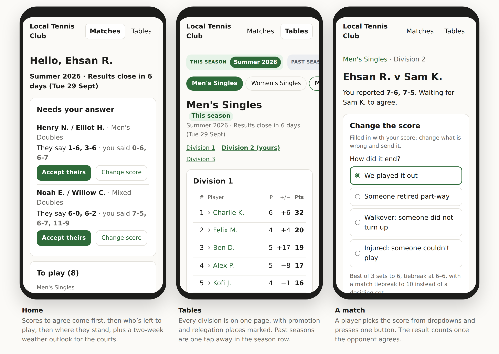

# DeuceLeague

Open-source tennis league software for a club. Players see their matches and
tables, report scores and agree their opponents' results from their phones.
The coach hands out sign-in links and runs the league, with a coding agent for
the bigger jobs. It runs on Cloudflare's free plan, in the club's own account.



## Try it

Deploy it with a sample club in mid-season, then play it as the coach and as
two players. It takes about fifteen minutes in your browser, with no email
service and no server.

[](https://deploy.workers.cloudflare.com/?url=https://github.com/EMRahman/DeuceLeague/tree/main)

**[Try DeuceLeague →](deploy/cloudflare/TRY.md)**

## Run your club

- [Start your club](deploy/cloudflare/GO-LIVE.md): a fresh deployment for real,
  your members and courts, and inviting players.
- [Running the league day to day](docs/COACH-WORKFLOW.md) with a coding agent.
- [Sign-in emails](deploy/cloudflare/EMAIL.md), [court forecasts](deploy/cloudflare/WEATHER.md)
  and [recovering administrator access](deploy/cloudflare/RECOVERY.md).
- [For coaches](https://emrahman.github.io/DeuceLeague/for-coaches.html): what
  it does and why, in more detail.

## Build on it

The league is an API. The players' website and the coach's site are adapters
on it, like anything a club builds with a coding agent: a bot, an app, a
report. The contract is published at `/openapi.json` on every deployment, with
a [readable reference](https://emrahman.github.io/DeuceLeague/api.html).

- [API concepts, permissions and workflows](docs/API.md)
- [How the deployment works](deploy/cloudflare/README.md)
- [Developing DeuceLeague](DEVELOPING.md): checks, running it locally, and API
  changes

### The model

A season contains competitions; each competition has divisions and entries.
Entries play matches. Standings are computed from confirmed results whenever
they are read. The coach reviews and applies promotion and relegation
placements for the next competition.

League rules are data: scoring, tiebreaks, promotion counts, withdrawals, and
deadlines belong to each competition. The core serves JSON. Websites, apps,
and tools build on the API.

### What is here

```
packages/schema   Shared Zod schemas for scores, formats, and rules       MIT
packages/engine   Fixtures, standings, result decisions, and placements   AGPL
packages/db-d1    D1 schema, migrations, and persistence                  AGPL
packages/api      HTTP API and OpenAPI contract                            AGPL
adapters/website  Reference player website                                 MIT
adapters/coach    Coach's website: sign-in links for players              MIT
deploy/cloudflare Worker deployment, installer, and recovery tooling
docs/API.md       API concepts, permissions, and workflows
```

## From VPS to Cloudflare

DeuceLeague began as a Docker and PostgreSQL application on a small VPS, which
left each club with a server to operate, secure, back up and update. It now
runs as one Cloudflare Worker and one D1 database per club. The original source
is preserved in the
[`vps-baseline-2026-09-28`](https://github.com/EMRahman/DeuceLeague/tree/vps-baseline-2026-09-28)
tag for reference, recovery, or a separate legacy fork.

## Licence

`packages/schema`, `adapters/website` and `adapters/coach` are MIT. The
server-side packages are AGPL-3.0-or-later.
